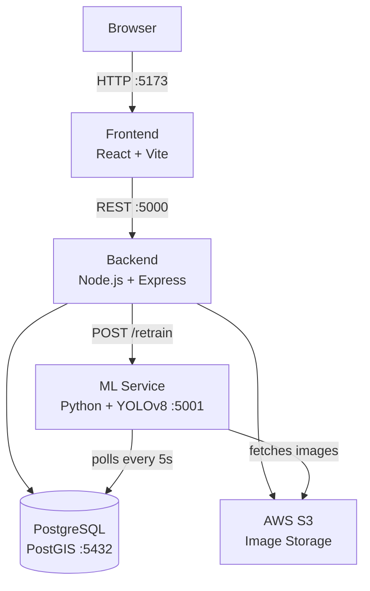
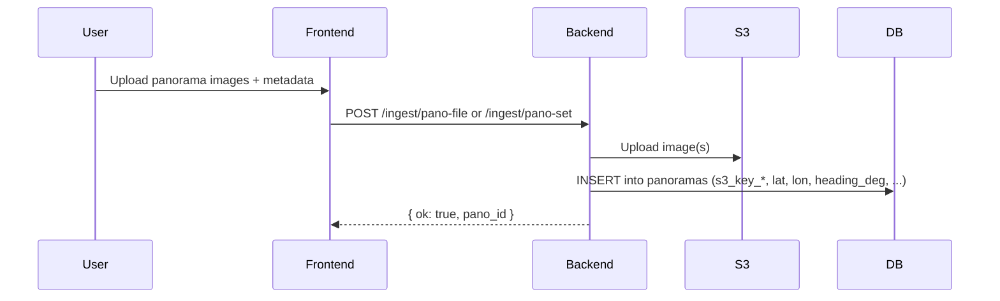
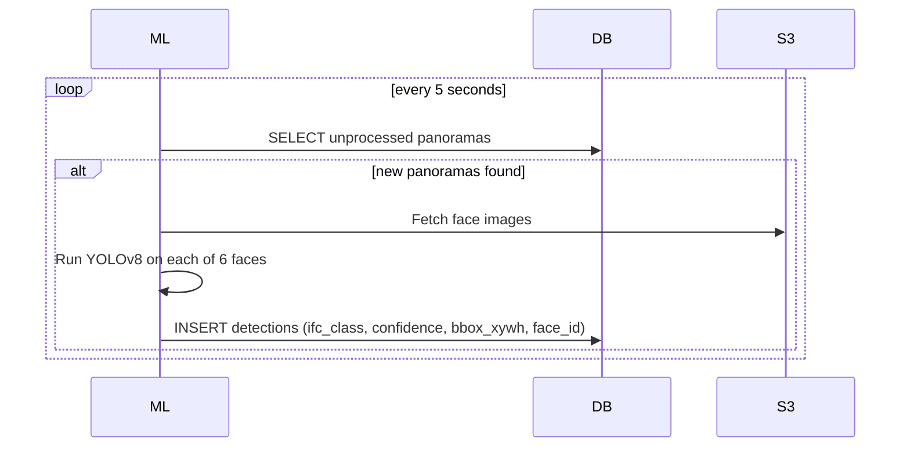
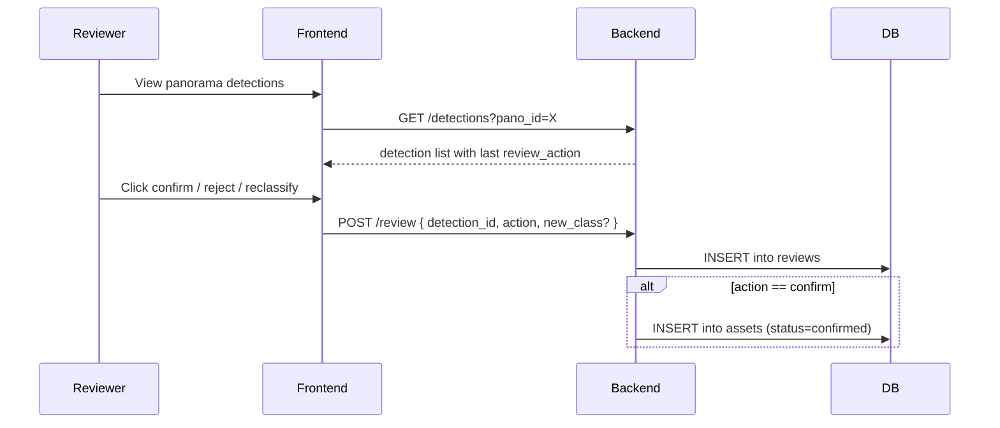
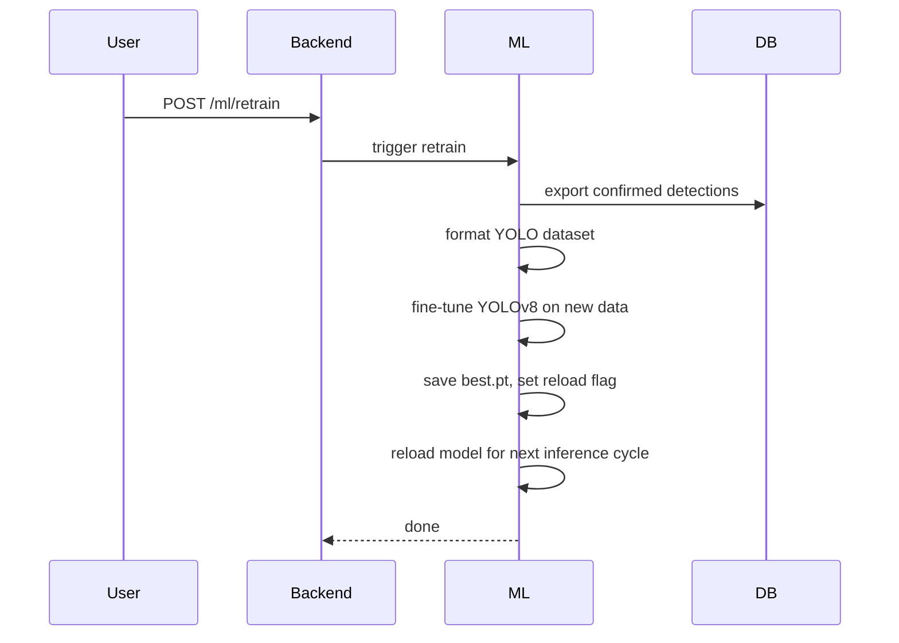
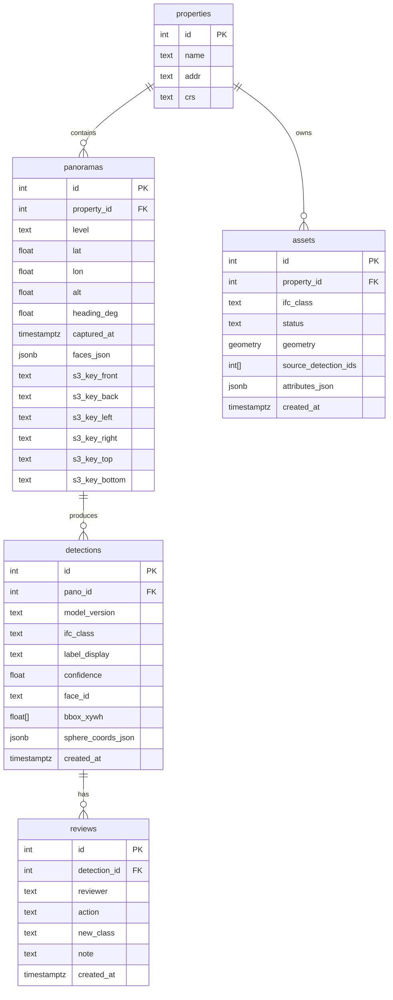
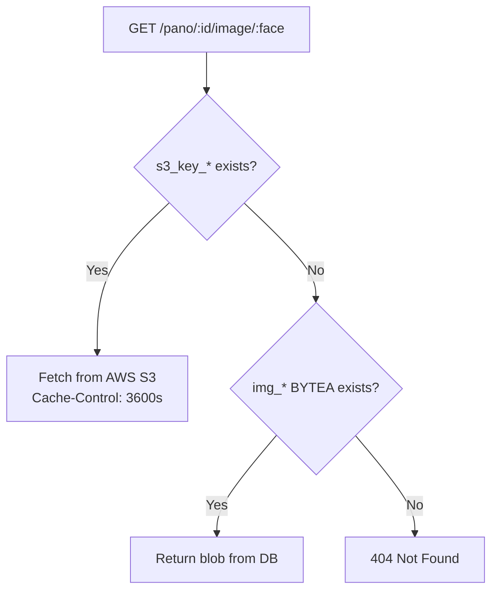

# System Architecture

## Overview

IFC Asset Detection is a four-service system: a React frontend, a Node.js/Express API, a Python/YOLO ML service, and a PostgreSQL/PostGIS database. Images are stored in AWS S3; metadata and detections are stored in the database.



---

## Services

| Service | Language / Framework | Port | Role |
|---|---|---|---|
| frontend | React 19, Vite 7, Three.js | 5173 | Review UI, upload, asset list |
| backend | Node.js 20, Express 4 | 5000 | REST API, auth, DB, S3 |
| ml | Python 3.11, YOLOv8, Flask | 5001 (internal) | Batch inference, retraining |
| db | PostgreSQL 15 + PostGIS | 5432 | Persistent storage |

All four services are orchestrated via Docker Compose.

---

## Data Flow

### Panorama Ingestion



### ML Detection Pipeline



### Review & Asset Confirmation



### Model Retraining



---

## Database Schema



> `s3_key_*` columns are used in cloud mode. The `img_*` BYTEA columns exist for legacy/local use and are empty in cloud deployments.

---

## Image Loading Strategy



---

## API Reference

### Authentication
| Method | Path | Description |
|---|---|---|
| POST | `/login` | Returns JWT token (24h expiry) |

### Panoramas
| Method | Path | Description |
|---|---|---|
| POST | `/ingest/pano-file` | Upload single panorama file |
| POST | `/ingest/pano-set` | Upload 6-face cubemap set |
| GET | `/panoramas` | List panoramas (`?unreviewed=true` filter) |
| GET | `/pano/:id` | Panorama metadata + face availability |
| GET | `/pano/:id/image/:face` | Stream face image (S3 or blob fallback) |

### Detections
| Method | Path | Description |
|---|---|---|
| GET | `/detections?pano_id=X` | All detections for a panorama with last review action |
| POST | `/detection/:id/class` | Update IFC class |
| POST | `/detection/:id/bbox` | Edit bounding box |

### Reviews & Assets
| Method | Path | Description |
|---|---|---|
| POST | `/review` | Confirm / reject / reclassify a detection |
| GET | `/assets?property_id=X` | List confirmed assets |

### ML
| Method | Path | Description |
|---|---|---|
| POST | `/ml/retrain` | Trigger model retraining |
| GET | `/ml/retrain/status` | Retraining status: idle / running / done / error |

### Health
| Method | Path | Description |
|---|---|---|
| GET | `/health` | Liveness probe |

---

## IFC Class Mapping

The ML service uses `ml/ifc_class_mapping.json` to map YOLO output class names to IFC types. Currently 17 classes are supported:

`ifcDoor`, `ifcWindow`, `ifcWall`, `ifcFurniture`, `ifcLightFixture`, `ifcAirTerminal`, `ifcComputer`, `ifcSwitchingDevice`, `ifcSensor`, `ifcAudioVisualAppliance`, `ifcElectricalOutlet`, `ifcSanitaryTerminal`, `ifcEquipmentElement`, `ifcFurnishingElement`, `ifcDuctSegment`, `ifcController`, `ifcSign`

To add a class: update `ifc_class_mapping.json` and retrain the YOLO model on labeled examples.

---

## Deployment

### Docker Compose (Development)

```
docker compose up -d
```

Services start in order: db → backend → frontend → ml.

**Volumes:**
- `db_data` — PostgreSQL persistence
- `./runs` — YOLO training outputs

### AWS Production (Recommended)
- **Database:** AWS RDS PostgreSQL 15+ with PostGIS extension
- **Images:** AWS S3 with IAM credentials scoped to `s3:GetObject` + `s3:PutObject`
- **Compute:** ECS/EC2 containers built from each service's Dockerfile
- **Region:** US regions only (data residency requirement)

### CI/CD

GitHub Actions (`.github/workflows/ci.yml`) runs on push/PR to `main`:
1. Frontend: lint + test + build
2. Backend: test
3. ML: pytest

Repository: https://github.com/IronThorn17/ifc-asset-detection
CI runs: https://github.com/IronThorn17/ifc-asset-detection/actions
