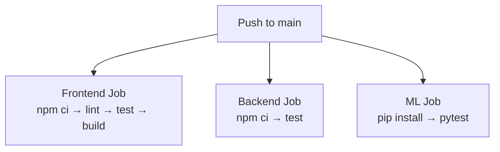
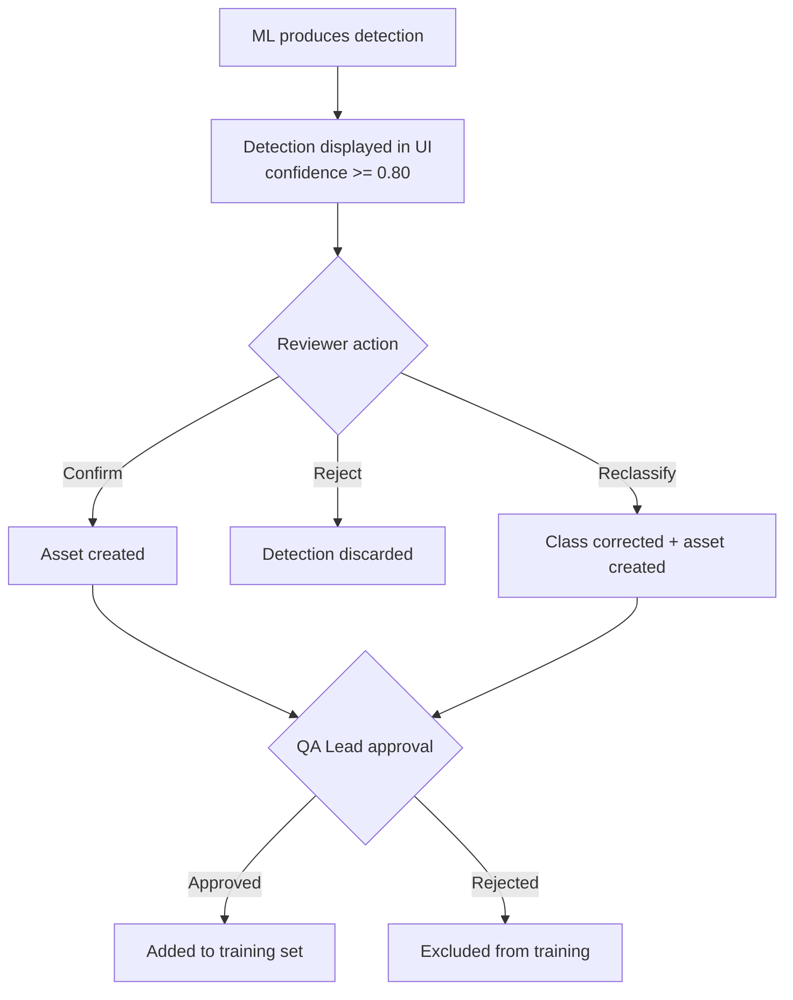

# Quality Assurance Plan
## 360° IFC Asset Detection and Review Prototype

**Version:** 1.0
**Date:** 2026-04-22
**Team:** Gavin Woodruff, Prashant Kandel, Jonah Deschenes
**Course:** SE 491

---

## Table of Contents

1. [Quality Standards](#1-quality-standards)
2. [Quality Objectives](#2-quality-objectives)
3. [Roles and Responsibilities](#3-roles-and-responsibilities)
4. [Deliverables Subject to Quality Review](#4-deliverables-subject-to-quality-review)
5. [Quality Control Approach](#5-quality-control-approach)
6. [Test Cases](#6-test-cases)

---

## 1. Quality Standards

Testing is based on **ISO/IEC/IEEE 29119-1** (Software and Systems Engineering — Software Testing — Concepts and Definitions).

Additional standards referenced:
- IEEE Std 830-1998 — for requirements traceability in test design
- IEEE Std 1016-2009 — for design-level test coverage

---

## 2. Quality Objectives

Detection accuracy is not a fixed pass/fail target for this prototype. The system was developed as a university senior project with a small team using a limited dataset provided by the contracted client. Accuracy improves iteratively: as reviewers confirm and reclassify detections, those labeled examples are fed back into the training pipeline, and the model is retrained to become progressively more accurate over time. The quality objectives below reflect prototype-stage targets.

| Objective | Target |
|---|---|
| API reliability | All documented endpoints return correct responses under normal conditions |
| Detection confidence threshold | Detections with confidence >= 0.80 are shown to reviewers; lower-confidence detections are suppressed |
| Initial model accuracy | Best-effort given the provided dataset; precision >= 0.60 mAP@0.5 on hold-out data after first labeled retraining cycle |
| Long-term model accuracy (post-prototype) | Improves with each retraining cycle as the labeled dataset grows through human review |
| Review workflow correctness | Confirm/reject/reclassify actions persist correctly and create the appropriate records |
| Upload reliability | Single-file and 6-face uploads succeed and images are retrievable from S3 |
| Model retraining | Retraining pipeline completes and the new model is loaded without service restart |
| Frontend responsiveness | UI actions complete within 200ms |

---

## 3. Roles and Responsibilities

| Role | Responsibility |
|---|---|
| Developer | Write and maintain unit and integration tests; fix defects identified in QA |
| QA Lead | Review test results; approve labeled detection batches for training set inclusion |
| Reviewer | Perform exploratory testing of the review UI during sprint demos |
| Project Manager | Track defect resolution and sign off on milestone acceptance criteria |

---

## 4. Deliverables Subject to Quality Review

| Deliverable | Review Type |
|---|---|
| Backend REST API | Automated integration tests (Jest + Supertest) |
| ML inference pipeline | Unit tests (pytest) |
| Frontend review workflow | Manual exploratory testing during bi-weekly demos |
| Database schema | Schema migration review; query correctness |
| Docker Compose setup | Smoke test: `docker compose up` produces working services |
| Detection accuracy | mAP@0.5 metric on hold-out property after each training cycle |

---

## 5. Quality Control Approach

### 5.1 Automated Testing

Tests run in CI on every push/PR to `main` via GitHub Actions.

Repository: https://github.com/IronThorn17/ifc-asset-detection
CI run history: https://github.com/IronThorn17/ifc-asset-detection/actions

| Layer | Framework | Location | Count |
|---|---|---|---|
| Backend API & business logic | Jest + Supertest | `backend/tests/index.test.js` | 25 tests |
| Backend authentication middleware | Jest + Supertest | `backend/tests/auth.test.js` | 8 tests |
| ML utility functions | pytest | `ml/test_utils.py` | 19 tests |
| Frontend build | Vite test runner | `frontend/` | — |

**Total automated tests: 52**

### 5.2 CI Pipeline

### 5.3 Review Workflow

The human review workflow in the UI acts as a quality gate for ML detections:

### 5.4 Model Evaluation

After each retraining cycle, the model is evaluated against a held-out property not used in training.

**Primary metric:** precision@0.5 IoU at 0.80 confidence threshold

**Secondary metrics:**
- Recall per class
- Per-class confusion matrix
- Review throughput (detections/min)
- Acceptance rate (confirmed / total reviewed)

**Target (M3 milestone):** >= 0.60 mAP@0.5 overall; precision >= 0.75 for top 10 classes

---

## 6. Test Cases

### 6.1 Backend API Tests (`backend/tests/index.test.js`)

| ID | Test | File | Expected Result |
|---|---|---|---|
| BE-01 | GET `/health` | index.test.js | Returns `{ ok: true }` with status 200 |
| BE-02 | POST `/login` with valid credentials | index.test.js | Returns JWT token and username, status 200 |
| BE-03 | POST `/login` with invalid credentials | index.test.js | Returns 401 |
| BE-04 | POST `/login` with wrong password | index.test.js | Returns 401 |
| BE-05 | GET `/panoramas` | index.test.js | Returns array with status 200 |
| BE-06 | GET `/panoramas` when empty | index.test.js | Returns empty array with status 200 |
| BE-07 | GET `/panoramas?unreviewed=true` | index.test.js | Query contains WHERE EXISTS clause |
| BE-08 | GET `/pano/:id` found | index.test.js | Returns panorama metadata |
| BE-09 | GET `/pano/:id` not found | index.test.js | Returns 404 |
| BE-10 | GET `/pano/:id/image/:face` with blob | index.test.js | Returns image bytes with Content-Type image/jpeg |
| BE-11 | GET `/pano/:id/image/:face` pano not found | index.test.js | Returns 404 |
| BE-12 | GET `/pano/:id/image/:face` face missing | index.test.js | Returns 404 |
| BE-13 | GET `/detections?pano_id=X` | index.test.js | Returns detections array |
| BE-14 | GET `/detections?pano_id=X` empty | index.test.js | Returns empty array |
| BE-15 | POST `/detection/:id/class` | index.test.js | Calls UPDATE with correct class and label_display |
| BE-16 | POST `/detection/:id/bbox` | index.test.js | Returns updated bbox_xywh |
| BE-17 | POST `/review` action=reject | index.test.js | Inserts review row, no asset created |
| BE-18 | POST `/review` action=reclassify | index.test.js | Inserts review with new_class |
| BE-19 | POST `/review` action=confirm — creates asset | index.test.js | Makes 4 DB calls; last is INSERT INTO assets |
| BE-20 | POST `/review` action=confirm — asset already exists | index.test.js | Makes only 2 DB calls; no duplicate asset |
| BE-21 | POST `/review` DB error | index.test.js | Returns 500 |
| BE-22 | GET `/assets` all | index.test.js | Returns assets array |
| BE-23 | GET `/assets?property_id=X` | index.test.js | Query contains WHERE a.property_id |
| BE-24 | GET `/assets` empty | index.test.js | Returns empty array |
| BE-25 | POST `/ingest/pano-set` no front/back | index.test.js | Returns 400 with error message |

### 6.2 Backend Authentication Tests (`backend/tests/auth.test.js`)

| ID | Test | Expected Result |
|---|---|---|
| AU-01 | POST `/review` — no Authorization header | Returns 401 |
| AU-02 | POST `/review` — empty Bearer token | Returns 401 |
| AU-03 | POST `/review` — invalid token string | Returns 403 |
| AU-04 | POST `/review` — token signed with wrong secret | Returns 403 |
| AU-05 | POST `/review` — valid token | Returns 200 |
| AU-06 | POST `/detection/:id/class` — no token | Returns 401 |
| AU-07 | POST `/detection/:id/bbox` — no token | Returns 401 |
| AU-08 | POST `/ml/retrain` — no token | Returns 401 |

### 6.3 ML Unit Tests (`ml/test_utils.py`)

| ID | Test | Expected Result |
|---|---|---|
| ML-01 | `normalize_bbox` center box on 200x200 | Returns `[0.5, 0.5, 0.5, 0.5]` |
| ML-02 | `normalize_bbox` corner box on 200x200 | Returns `[0.1, 0.1, 0.2, 0.2]` |
| ML-03 | `normalize_bbox` non-square image | Returns correct normalized values |
| ML-04 | `normalize_bbox` box extends outside image | All values clamped to [0, 1] |
| ML-05 | `normalize_bbox` zero image width | Returns `[0, 0, 0, 0]` |
| ML-06 | `normalize_bbox` zero image height | Returns `[0, 0, 0, 0]` |
| ML-07 | `normalize_bbox` both dimensions zero | Returns `[0, 0, 0, 0]` |
| ML-08 | `normalize_bbox` return length | Returns exactly 4 values |
| ML-09 | `is_valid_face_column` all valid columns | All 6 face columns pass |
| ML-10 | `is_valid_face_column` invalid name | Returns False |
| ML-11 | `is_valid_face_column` name without prefix | Returns False |
| ML-12 | `is_valid_face_column` empty string | Returns False |
| ML-13 | `is_valid_face_column` SQL injection string | Returns False |
| ML-14 | `is_valid_face_column` partial column name | Returns False |
| ML-15 | `load_ifc_class_mapping` real file | Returns non-empty dict |
| ML-16 | `load_ifc_class_mapping` required classes present | ifcDoor, ifcWindow, ifcWall all present |
| ML-17 | `load_ifc_class_mapping` entry structure | Every entry has `category` and `description` |
| ML-18 | `load_ifc_class_mapping` missing file | Returns empty dict without raising |
| ML-19 | `load_ifc_class_mapping` invalid JSON | Returns empty dict without raising |

### 6.3 Integration / End-to-End Tests

| ID | Test | Expected Result |
|---|---|---|
| E2E-01 | Upload panorama → wait for ML poll → check detections exist | Detections appear in GET `/detections?pano_id=X` |
| E2E-02 | Confirm 10 detections across 3 classes → check assets table | 10 rows in `assets` with status=confirmed |
| E2E-03 | Reclassify a detection → check new_class persisted | `reviews` row has correct new_class; asset has updated ifc_class |
| E2E-04 | POST `/ml/retrain` → poll status until done → check model version | Retraining completes; next detection uses updated model |
| E2E-05 | `docker compose up` cold start | All 4 services healthy within 60 seconds |

### 6.4 Milestone Acceptance Tests

These tests correspond to the acceptance criteria defined in the project scope.

| ID | Test | Milestone |
|---|---|---|
| ACC-01 | Upload >= 50 panos → run batch inference → detections appear in UI | M2 |
| ACC-02 | Reviewer confirms/rejects >= 100 detections across >= 10 classes; reclassification works; all actions auditable in DB | M2 |
| ACC-03 | Export creates a labeled dataset consumable by the retrain job | M3 |
| ACC-04 | System runs end-to-end with `docker compose up` and default .env | M5 |
