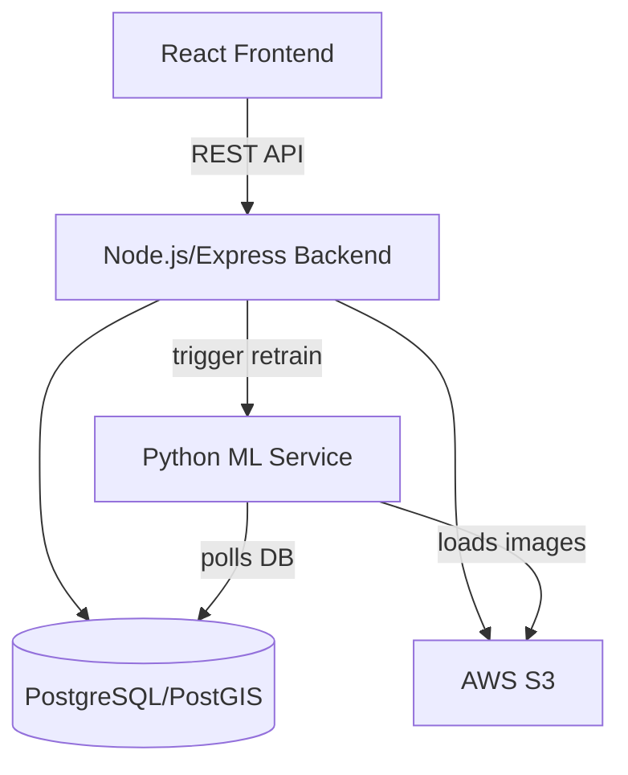
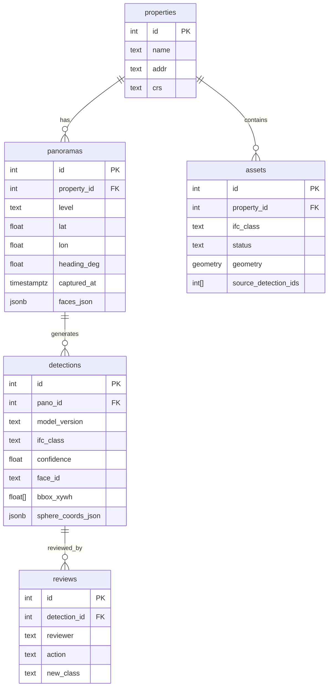

# Project Scope: 360° IFC Asset Detection, Review, and Geolocation Prototype

**Client:** Retail Digital Twin Platform
**Date:** 2025-08-27

---

## 0. Executive Summary

Build a prototype that automatically identifies IFC physical elements in indoor/outdoor 360° panoramas (cubemap faces), presents them for human review in a React UI, and (optionally) geolocates assets to draw points/lines/polygons on a map. The prototype emphasizes open-source models, batch processing, and a human-in-the-loop improvement loop suitable for retail property portfolios.

---

## 1. Goals & Success Criteria

**Business outcome:** Replace manual asset identification with automated detection from property imagery.

**Must-haves:**
- Detect IFC physical elements in cubemap panoramas (all six faces)
- Present detections in a React UI for user review
- Allow user to approve/decline/reclassify to improve model accuracy (labels feed the training set post-QA)

**Nice-to-haves:**
- Use pano heading + geo to place assets on a map
- Draw asset geometries (points/lines/polygons) on a map
- Package models/services for AWS deployment

**Target accuracy:** 80% confidence threshold for presenting candidates. Primary metric for V1 is precision@0.5 IoU at the review threshold; recall and per-class confusion reported as secondary metrics.

**Geo accuracy:** No formal requirement; elevation not required.

**KPI cadence:** Bi-weekly reviews (demo + metrics snapshot + risks).

---

## 2. Scope

### In-scope
- Vision models for classifying/detecting IFC physical elements in 360° cubemap panoramas
- Review UI: panorama viewer, detection overlays, asset table, approve/reject/reclassify
- Data pipeline & storage (S3 + PostgreSQL/PostGIS) for images, detections, assets, and reviews
- Labeling sprint to bootstrap training data; active learning loop (post-QA)
- (Nice-to-have) Bearing-based geolocation & simple geometry extraction; map rendering in React
- Packaging for batch inference; basic ops/observability

### Out-of-scope (prototype)
- Full BIM reconstruction, SLAM/SfM, or accurate indoor mapping beyond bearing triangulation
- Complex change detection/versioning across renovation phases
- Brand-specific signage recognition (detect as generic signage)
- Enterprise SSO/RBAC

### Assumptions
- IFC 4.3 (IFC4x3) as primary mapping; fall back to IFC4 where needed
- Panoramas captured on Ricoh Theta Z1; cubemap faces available with Lat/Lon + Heading metadata and Level (floor) tags; floor plans usually available
- Pilot scale: 5 properties, 20–200 panos/property; batch inference acceptable (e.g., nightly)
- Open-source stack; US data residency

---

## 3. V1 IFC Taxonomy (Retail-oriented)

Geometry type indicates how features are represented on the map in V1.

### Architectural
| Class | Map Geometry |
|---|---|
| IfcWall | line (centerline, indoor) |
| IfcDoor | point |
| IfcWindow | point |
| IfcColumn | point (plan location) |
| IfcRailing | line |
| IfcStair / IfcStairFlight | polygon (footprint) or point (V1 simplified) |
| IfcCovering (CEILING/FLOOR/WALLFINISH) | polygon (optional, segmentation only) |

### MEP — HVAC & Controls
| Class | Map Geometry |
|---|---|
| IfcAirTerminal (diffuser, grille, register) | point |
| IfcDuctSegment (exposed) | line (optional) |
| IfcUnitaryEquipment / IfcAirConditioningUnit (RTU/AHU) | point |
| IfcSensor (thermostat/temperature) | point |

### Electrical & Lighting
| Class | Map Geometry |
|---|---|
| IfcLightFixture (ceiling/wall) | point |
| IfcElectricalPanel (panelboard) | point |
| IfcOutlet / IfcSwitchingDevice | point (optional) |

### Fire & Life Safety
| Class | Map Geometry |
|---|---|
| IfcFireSuppressionTerminal (sprinkler head) | point |
| IfcFireAlarm / IfcDetector (smoke/heat) | point |
| IfcFireHydrant (site) | point |

### Plumbing
| Class | Map Geometry |
|---|---|
| IfcSanitaryTerminal (toilet/urinal/sink) | point |
| IfcWasteTerminal (floor drain) | point |

### Site & Exterior
| Class | Map Geometry |
|---|---|
| IfcSign (site signage) | point |
| IfcLightingDevice (site light pole) | point |
| IfcElectricChargingUnit (EV charger) | point |
| IfcPavement (parking lot/drive) | polygon |

### Furnishings & Retail Fixtures
| Class | Map Geometry |
|---|---|
| IfcFurniture (bench, table) | point |
| IfcFurnishingElement (shelving/gondolas) | line or polygon (default point in V1) |
| IfcBollard | point |

> A class→display mapping is maintained for the UI (e.g., "Door", "Light Fixture") and a class→IFC mapping for export. The list can be trimmed for V1 if needed.

---

## 4. Data & Inputs

- **Imagery:** Cubemap (front/back/left/right/up/down) from Ricoh Theta Z1; typical 23MP pano; faces stored as JPEG/PNG
- **Metadata:** `{ pano_id, property_id, level, lat, lon, heading_deg, capture_time, face_urls[] }`
- **Floor plans:** Raster (PNG/PDF) or vector (DXF/SVG); optional alignment to world coords per site
- **Storage:** Images in S3; metadata and results in PostgreSQL/PostGIS

---

## 5. Technical Approach

### 5.1 Detection & Segmentation
- **Backbone:** Open-vocabulary detector (GroundingDINO) + instance segmentation (SAM or HQ-SAM) to bootstrap across many classes without large labeled sets
- **Fine-tuning:** After labeling sprint, fine-tune a compact detector (YOLOv8) on the curated IFC taxonomy for higher precision/latency gains
- **360 handling:** Run inference per cubemap face; convert to common spherical coords for cross-face NMS/merging near seams
- **Class prompts:** Maintain a prompt list per IFC class (and synonyms) for the open-vocabulary stage

### 5.2 Tracking/Association Across Panos (optional)
- ReID/embedding matching to merge the same asset seen in adjacent panos (cosine similarity on visual embeddings + spatial proximity on pano graph)

### 5.3 Geometry Extraction (nice-to-have)
- **Point features:** Ray bearing from pano position using face FOV + global heading; triangulate via bearing intersections from >=2 panos
- **Line features (walls/curbs):** Semantic segmentation + Hough/edge tracing per face, reproject to ground plane
- **Polygon features (parking/sidewalk):** Region segmentation; approximate polygon via contour simplification

### 5.4 Quality Control & Active Learning
- Show detections >= 0.80 confidence
- QA workflow: reviewer confirms/rejects/reclassifies; QA lead batch-approves; only then labels join the training set
- Retraining cadence: as needed during prototype

---

## 6. System Architecture

- **Frontend:** React (Vite) + 360 pano viewer; state via TanStack Query
- **Backend APIs:** Node.js/Express for ingestion, auth, detections, assets, reviews, and export
- **Batch Inference:** Python service (Docker) polls unprocessed panos, runs YOLO pipeline, writes to DB
- **Storage:** S3 (images), PostgreSQL/PostGIS (metadata, detections, assets, geometries)
- **Deployment:** Local Docker Compose for dev; AWS-ready containers as a nice-to-have

---

## 7. Data Model

---

## 8. API (Prototype)

| Method | Endpoint | Description |
|---|---|---|
| POST | `/ingest/pano` | Register pano + faces + metadata |
| GET | `/detections?pano_id=` | List detections for a panorama |
| POST | `/review` | Submit confirm/reject/reclassify action |
| GET | `/assets?property_id=` | Confirmed assets + geometries |
| POST | `/ml/retrain` | Trigger model retraining |

---

## 9. Frontend UX

**Views:**
1. **Pano Review** — 360 viewer with detection overlays, sortable detection list, confirm/reject/reclassify actions
2. **Upload** — Bulk upload or 6-face panorama set upload
3. **Assets** — Confirmed asset inventory filtered by property
4. **Map View (nice-to-have)** — Points, lines, polygons via Deck.gl layers

---

## 10. Labeling Sprint Plan

- **Tool:** Open-source annotator (CVAT/Label Studio)
- **Target:** ~300–600 panos labeled (balanced indoor/outdoor, day/night), aiming for 8–15k instances across 20–30 classes
- **Guidelines:** Lowest reasonable class granularity; occlusions allowed if >30% visible; generic "Signage" for branded signs
- **Review:** Daily spot-checks; weekly guideline updates

---

## 11. Evaluation Plan

- **Metrics:** mAP@0.5, per-class precision/recall, review throughput (detections/min), acceptance rate
- **Test split:** Hold-out properties (at least 1 site) never used in training
- **Report:** Snapshot at each bi-weekly meeting; confusion matrix + top error modes

---

## 12. Risks & Mitigations

| Risk | Mitigation |
|---|---|
| Low light / reflective glass | HDR/denoise pre-processing; conservative thresholds; human review |
| Class imbalance (rare EV chargers) | Targeted sampling; class-balanced loss; data augmentation |
| Seam artifacts in cubemap | Spherical NMS and seam padding |
| Weak geolocation from single pano | Require >=2-pano triangulation or manual placement; visualize uncertainty |
| Floor plan misalignment | Manual anchor points; store transform per level |

---

## 13. Milestones

| Milestone | Description | Acceptance |
|---|---|---|
| M0 | Project kickoff & taxonomy freeze | Signed class list, schema PRs merged |
| M1 | Labeling sprint & baseline inference | Detections visible in UI; >=15 classes with usable precision |
| M2 | Review UI | Confirm/reject/reclassify works; data stored; batch export works |
| M3 | Fine-tuned detector & active learning | >=0.60 mAP@0.5 on hold-out; precision >=0.75 for top 10 classes at 0.8 threshold |
| M4 | Map & geometry (nice-to-have) | User can place/adjust features; export GeoJSON |
| M5 | Packaging & handoff | One-command local deploy; runbooks complete |

Bi-weekly demos: End of Weeks 2, 4, 6, 8.

---

## 14. Security, Privacy, Compliance

- US data residency; images and outputs in US AWS regions
- Face/license-plate blur respected (no unblurring)
- Minimal PII; no brand-specific signage recognition
- Basic token auth; audit log of review actions
