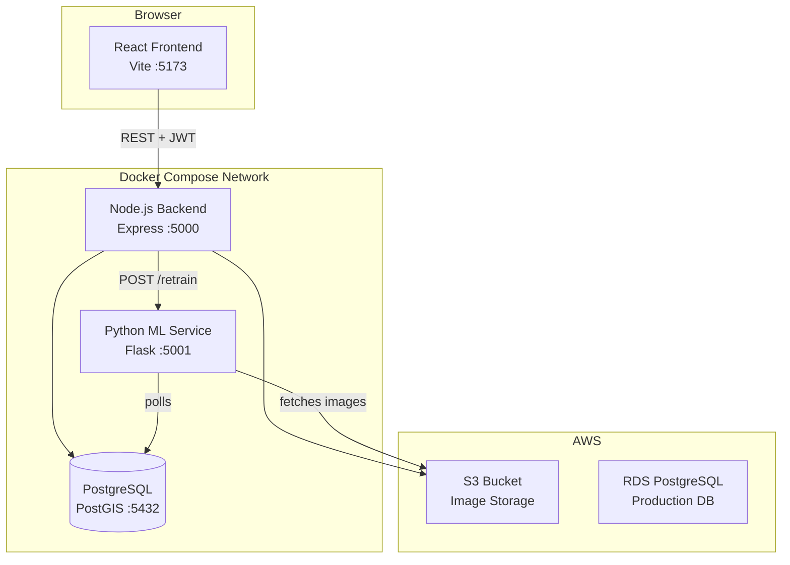
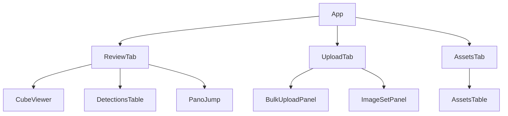
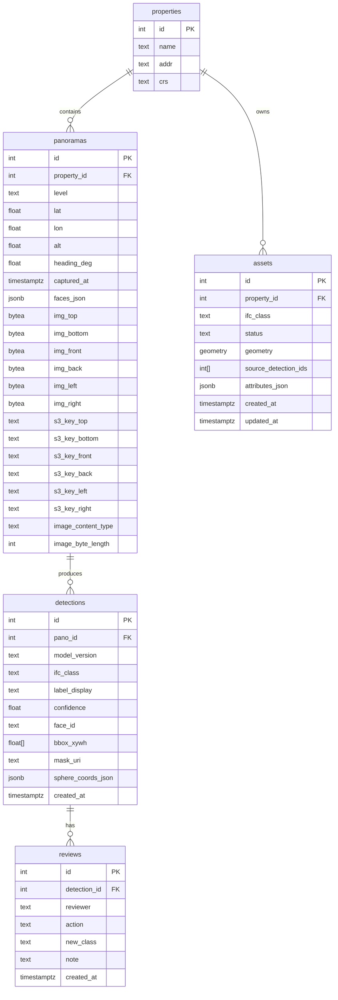
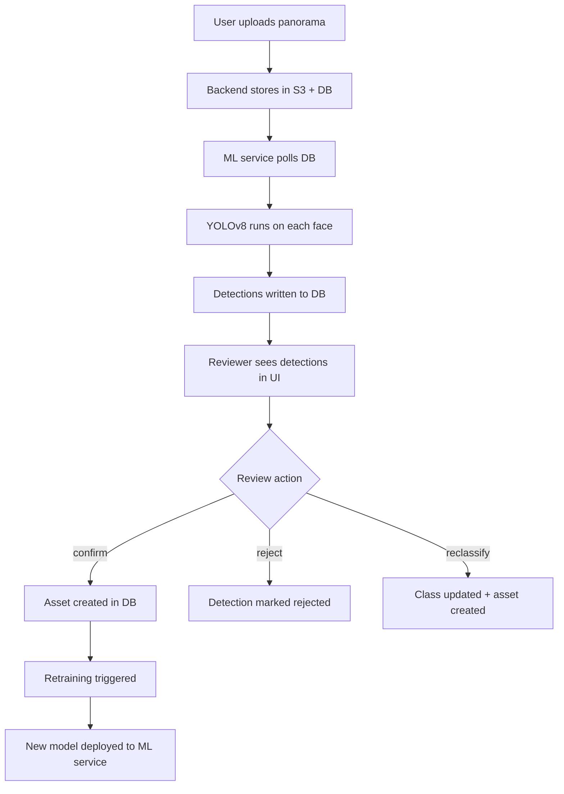
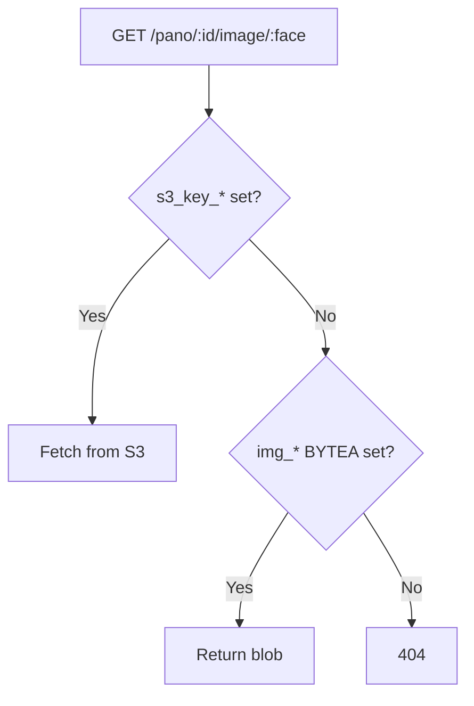
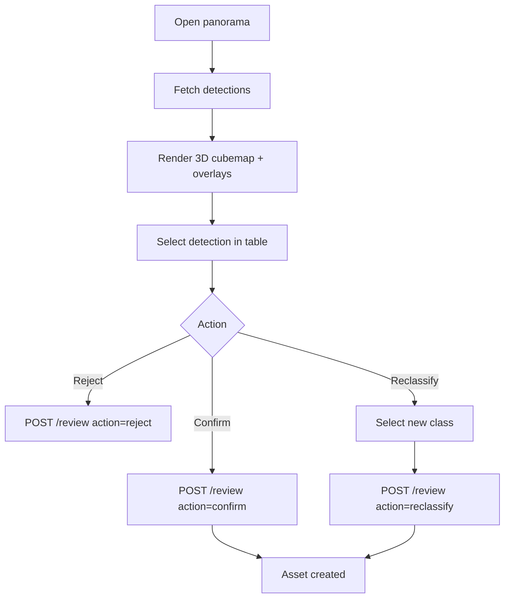
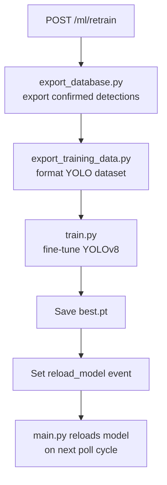
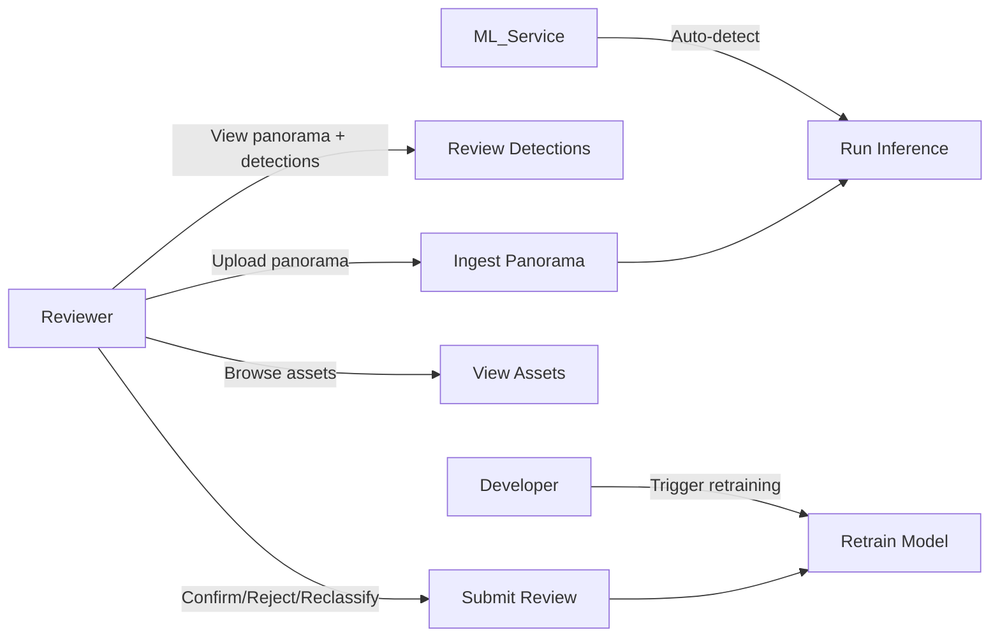
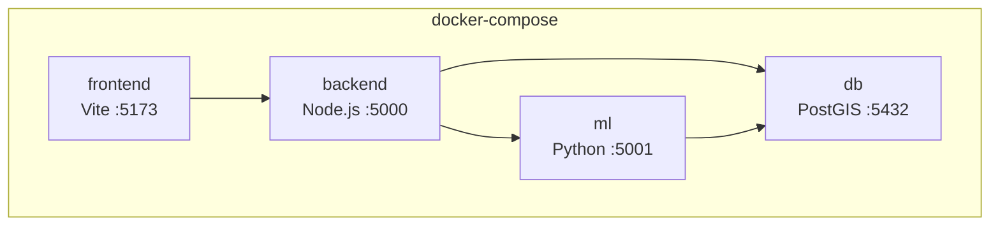

# Software Design Document
## 360° IFC Asset Detection and Review Prototype

**Version:** 1.0
**Prepared by:** Gavin Woodruff, Prashant Kandel, Jonah Deschenes
**Organization:** St. Cloud State University
**Date:** 2025-10-01

**Standards:**
- IEEE Std 1016-2009 — Software Design Descriptions
- IEEE Std 830-1998 — Software Requirements Specifications
- IEEE/EIA 12207.1-1997 — Software Lifecycle Processes

---

## Table of Contents

1. [Purpose](#1-purpose)
2. [System Architecture](#2-system-architecture)
3. [Component Design](#3-component-design)
4. [Data Design](#4-data-design)
5. [Interface Design](#5-interface-design)
6. [Process Flows](#6-process-flows)
7. [Deployment](#7-deployment)
8. [Future Improvements](#8-future-improvements)
9. [Glossary](#9-glossary)

---

## 1. Purpose

The main purpose of this system is to automatically detect IFC assets in cubemap panoramas using machine learning and present them for human review.

Design goals:
- **Robustness:** Modularized components for frontend, backend, ML, and database layers
- **Scalability:** Containerized microservices deployable locally or on AWS
- **Efficiency:** Optimized detection and review workflows for near real-time labeling
- **Replicability:** Docker Compose setup for uniform development and deployment
- **Reusability:** Services can be extended or reused in similar computer vision pipelines

---

## 2. System Architecture

The system follows a microservices pattern with four independently deployable services communicating over a Docker Compose bridge network.



### Service Responsibilities

| Service | Stack | Responsibility |
|---|---|---|
| frontend | React 19, Vite 7, Three.js | 3D panorama viewer, detection review UI, upload forms |
| backend | Node.js 20, Express 4, pg, AWS SDK v3 | REST API, JWT auth, DB access, S3 integration |
| ml | Python 3.11, YOLOv8, Flask, boto3, psycopg | Batch inference daemon, retraining API |
| db | PostgreSQL 15 + PostGIS | Persistent storage for all structured data |

---

## 3. Component Design

### 3.1 Frontend

**Technology:** React 19, Vite 7, Three.js 0.180

The frontend is a single-page application with three primary views controlled by tab state in `App.jsx`.



**Key components:**

| Component | File | Role |
|---|---|---|
| CubeViewer | `frontend/src/components/CubeViewer.jsx` | Three.js cubemap renderer; draws bounding box overlays |
| DetectionsTable | `frontend/src/components/DetectionsTable.jsx` | Detection list; confirm/reject/reclassify actions; inline bbox edit |
| AssetsTable | `frontend/src/components/AssetsTable.jsx` | Confirmed asset inventory with property filter |
| BulkUploadPanel | `frontend/src/components/BulkUploadPanel.jsx` | Multi-file upload with progress |
| ImageSetPanel | `frontend/src/components/ImageSetPanel.jsx` | 6-face upload form with metadata fields |
| Login | `frontend/src/components/Login.jsx` | JWT authentication form |
| PanoJump | `frontend/src/components/PanoJump.jsx` | Quick navigation between panoramas |

API calls are centralized in `frontend/src/api.js`, which attaches the JWT token from `localStorage` to all authenticated requests.

### 3.2 Backend

**Technology:** Node.js 20, Express 4.19, pg (PostgreSQL), AWS SDK v3, jsonwebtoken, bcrypt, multer

The backend is a single Express application (`backend/index.js`) with route handlers organized by domain. There is no separate router file — routes are registered inline.

**Middleware stack:**
1. CORS
2. JSON body parser
3. Multer (for file uploads, max 50MB)
4. JWT verification (on protected routes)

**Database access:** Connection pool via `backend/db.js` using the `pg` library.

**S3 access:** Uses `@aws-sdk/client-s3` with credentials from environment variables. Falls back gracefully when `AWS_S3_BUCKET` is not set.

### 3.3 ML Service

**Technology:** Python 3.11, YOLOv8 (Ultralytics), Flask, boto3, psycopg, OpenCV

The ML service has two distinct processes:

| Process | File | Role |
|---|---|---|
| Inference daemon | `ml/main.py` | Polls DB every 5s, runs YOLO on unprocessed panos, writes detections |
| Retraining API | `ml/server.py` | Flask server listening on :5001; handles `/retrain` POST from backend |

**Model files:**
- `ml/model/best.pt` — active fine-tuned model
- `ml/model/20260311.pt` — fallback model

**IFC class mapping:** `ml/ifc_class_mapping.json` defines 17 classes with display names, IFC type, category, and description. The inference daemon enriches each detection with this metadata in `sphere_coords_json`.

**Model reload:** `ml/shared.py` exposes a threading `Event` object. After retraining, `server.py` sets the event flag; `main.py` detects it and reloads `best.pt` without restarting the process.

---

## 4. Data Design

### 4.1 Database Schema



**Notes:**
- `panoramas.img_*` BYTEA columns are legacy; `s3_key_*` columns are used in cloud mode
- `detections.bbox_xywh` stores normalized center-based coordinates `[cx, cy, w, h]` in 0–1 range
- `assets.geometry` uses PostGIS `GEOMETRY` type, SRID 4326
- `assets.status` is constrained to `proposed | confirmed | rejected`
- `reviews.action` is constrained to `confirm | reject | reclassify`

### 4.2 S3 Key Structure

Single-file uploads:
```
uploads/panoramas/image/{uuid}/tiles/f/mobile.jpg
```

6-face set uploads follow the same pattern with face-specific subdirectories.

---

## 5. Interface Design

### 5.1 REST API

All endpoints are served by the backend on port 5000. Protected endpoints require `Authorization: Bearer <token>`.

**Authentication**

| Method | Path | Auth | Description |
|---|---|---|---|
| POST | `/login` | No | `{ username, password }` → `{ token, username }` |

**Panoramas**

| Method | Path | Auth | Description |
|---|---|---|---|
| POST | `/ingest/pano-file` | Yes | Upload single panorama; returns `{ ok, pano_id, s3_key }` |
| POST | `/ingest/pano-set` | Yes | Upload 6-face set; returns `{ ok, pano_id }` |
| GET | `/panoramas` | No | List panoramas; `?unreviewed=true` to filter |
| GET | `/pano/:id` | No | Panorama metadata + face availability |
| GET | `/pano/:id/image/:face` | No | Stream face image (S3 → blob fallback) |

**Detections**

| Method | Path | Auth | Description |
|---|---|---|---|
| GET | `/detections?pano_id=X` | No | All detections with last review_action |
| POST | `/detection/:id/class` | Yes | Update IFC class: `{ ifc_class }` |
| POST | `/detection/:id/bbox` | Yes | Update bounding box: `{ bbox_xywh }` |

**Reviews & Assets**

| Method | Path | Auth | Description |
|---|---|---|---|
| POST | `/review` | Yes | `{ detection_id, action, new_class?, note? }` |
| GET | `/assets?property_id=X` | No | Confirmed assets with property name |

**ML**

| Method | Path | Auth | Description |
|---|---|---|---|
| POST | `/ml/retrain` | Yes | Trigger retraining |
| GET | `/ml/retrain/status` | No | `{ status, phase, error? }` |
| GET | `/health` | No | `{ ok: true }` |

---

## 6. Process Flows

### 6.1 Main Flow



### 6.2 Image Loading



### 6.3 Detection Review



### 6.4 Model Retraining



### 6.5 Use Case Diagram



---

## 7. Deployment

### 7.1 Docker Compose (Development)



Services start in dependency order. The `db` volume (`db_data`) persists the database between restarts. Training outputs persist in the `./runs` volume.

### 7.2 Package Summary

| Service | Key Packages |
|---|---|
| frontend | react, vite, three, leaflet |
| backend | express, pg, @aws-sdk/client-s3, jsonwebtoken, bcrypt, multer |
| ml | ultralytics (YOLOv8), opencv-python-headless, flask, boto3, psycopg, numpy |

---

## 8. Future Improvements

- Cloud deployment pipeline (AWS ECS/ECR)
- Automated retraining schedule triggered by QA batch approval
- Improved model precision with larger labeled datasets
- Role-based access control (Reviewer vs Admin vs QA Lead)
- Real-time inference to reduce batch latency
- Change detection for renovation tracking
- Map view with bearing triangulation and GeoJSON export

---

## 9. Glossary

| Term | Definition |
|---|---|
| Cubemap | Six images representing front, back, left, right, top, bottom faces of a 360° panorama |
| IFC | Industry Foundation Classes — open BIM data standard |
| YOLOv8 | Real-time object detection neural network used for asset detection |
| bbox_xywh | Normalized bounding box: `[center_x, center_y, width, height]` in 0–1 range |
| PostGIS | PostgreSQL extension for spatial data and geometry queries |
| SRID 4326 | WGS84 geographic coordinate system used for lat/lon geometry |
| JWT | JSON Web Token used for API authentication |
| Active Learning | Iterative ML training strategy using human-labeled outputs to improve the model |
