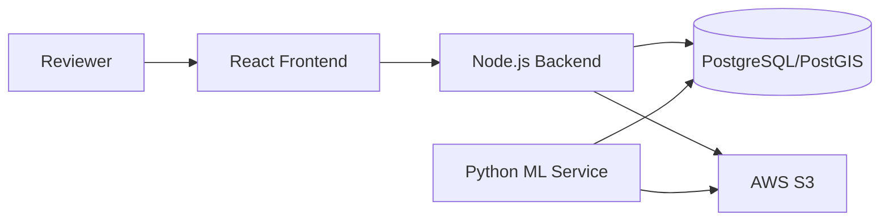

# Software Requirements Specification
## Automated IFC Asset Detection System

**Version:** 1.0
**Prepared by:** Gavin Woodruff, Prashant Kandel, Jonah Deschenes
**Organization:** St. Cloud State University
**Date:** 2025-10-01

---

## Revision History

| Version | Date | Author | Description |
|---|---|---|---|
| 1.0 | 2025-10-01 | Woodruff, Kandel, Deschenes | Initial release |

---

## Table of Contents

1. [Introduction](#1-introduction)
2. [Overall Description](#2-overall-description)
3. [System Features](#3-system-features)
4. [External Interface Requirements](#4-external-interface-requirements)
5. [Nonfunctional Requirements](#5-nonfunctional-requirements)
6. [Other Requirements](#6-other-requirements)
7. [Appendix A: Glossary](#appendix-a-glossary)

---

## 1. Introduction

### 1.1 Purpose

This Software Requirements Specification (SRS) defines the requirements for the 360° IFC Asset Detection and Review Prototype. The software enables automated detection of IFC assets in indoor and outdoor 360° panoramas, presents detections for human review through a React frontend, and optionally geolocates assets on a map.

This SRS covers the prototype version with an emphasis on detection, review UI, and a feedback loop to improve machine learning accuracy.

### 1.2 Document Conventions

Priorities are classified as:
- **High** — required for prototype delivery
- **Medium** — important but can be deferred within the sprint
- **Low** — nice-to-have

### 1.3 Intended Audience

- **Developers** — implementation reference
- **Project Managers** — scope and constraint tracking
- **Testers** — basis for test case design
- **Stakeholders** — acceptance criteria reference

### 1.4 Project Scope

The prototype replaces manual asset detection with automated detection from property panoramas. Benefits include faster asset documentation, lower operational costs, and higher accuracy across retail portfolios.

Core objectives:
- Detect IFC assets in cubemap panorama images using YOLOv8
- Provide a review UI for human confirmation, rejection, or reclassification
- Feed reviewer input back to an active learning loop to improve model performance

### 1.5 References

- Project Scope Document: *360° IFC Asset Detection, Review, and Geolocation Prototype* (Retail Digital Twin Platform, 2025-08-27)
- IEEE Std 830-1998 — Recommended Practice for Software Requirements Specifications
- IEEE/EIA 12207.1-1997 — Software Lifecycle Processes

---

## 2. Overall Description

### 2.1 Product Perspective

The prototype is a self-contained system that integrates computer vision, a React-based review UI, and a database for storage. It is intended for integration into a larger retail digital twin platform but operates independently.

**Major Components:**
- **Frontend:** React UI with 3D panorama viewer and detection review interface
- **Backend:** REST API for image ingestion, detection retrieval, review, and export
- **Machine Learning:** Python pipeline running YOLO detection on cubemap images
- **Database:** PostgreSQL with PostGIS for images, detections, assets, and metadata

### 2.2 Product Features

- Automated detection of IFC assets in 360° cubemap images using YOLOv8
- Panorama viewer with detection overlays, sortable detection table, and confirm/reject/reclassify actions
- Active learning loop: reviewer feedback updates training datasets for model retraining

### 2.3 User Classes and Characteristics

| User Class | Description |
|---|---|
| Reviewer | Reviews and approves/rejects/reclassifies ML detections |
| QA Lead | Approves labeled batches for inclusion in the training set |
| Developer | Maintains services, deploys infrastructure, manages data pipelines |
| Manager/Stakeholder | Views detection metrics and asset inventory |

### 2.4 Operating Environment

- **Frontend:** Modern web browsers (Chrome, Firefox, Edge)
- **Backend:** Node.js 20 in Docker containers
- **Database:** PostgreSQL 15 with PostGIS (local Docker or AWS RDS)
- **ML Service:** Python 3.11 in Docker containers; CUDA GPU recommended for production inference

### 2.5 Design and Implementation Constraints

- Frontend must use React
- Database must be PostgreSQL with PostGIS
- All components run in Docker containers
- Project budget: $100
- Project timeline: 8 months

### 2.6 User Documentation

There is no planned written documentation bundled with the software. A short onboarding/demonstration session will be provided to familiarize users with the review workflow.

### 2.7 Assumptions and Dependencies

- Geographic data (lat/lon/heading) embedded in or supplied with panoramas is accurate. Inaccurate geo data will prevent accurate map placement of assets.
- Access to a sufficient volume of labeled panoramas is required to train the detection model to acceptable accuracy.
- AWS credentials with S3 and RDS access are required for cloud deployment. Local Docker mode does not require AWS.

---

## 3. System Features

### 3.1 Panorama Ingestion

**Priority:** High

#### Description
Users upload panorama images into the system so the ML pipeline can run detections. Both single-file uploads and 6-face cubemap set uploads are supported.

#### Stimulus/Response
1. User navigates to the Upload screen
2. User selects one or more image files and fills in metadata (property, level, lat/lon, heading)
3. Backend stores images in AWS S3 (or as blobs in the database for local mode)
4. Backend inserts a row into `panoramas`
5. ML service detects the new panorama on its next polling cycle and runs inference

#### Functional Requirements

| ID | Requirement |
|---|---|
| FR-1.1 | The system must allow upload of a single equirectangular panorama file |
| FR-1.2 | The system must allow upload of a 6-face cubemap set (front, back, left, right, top, bottom) |
| FR-1.3 | The system must store panorama metadata including property_id, level, lat, lon, heading_deg, and captured_at |
| FR-1.4 | The system must store panorama images in AWS S3 and record the S3 key in the database |

### 3.2 Automated Asset Detection

**Priority:** High

#### Description
The ML service automatically detects IFC assets in uploaded panoramas using YOLOv8. Results are stored in the database and displayed in the UI.

#### Stimulus/Response
1. ML service polls the database every 5 seconds for panoramas without detections
2. For each unprocessed panorama, the ML service fetches all available face images
3. YOLOv8 runs on each face independently
4. Detections are inserted into the `detections` table with class, confidence, face ID, and normalized bounding box
5. Frontend displays detections as overlays on the 3D panorama viewer

#### Functional Requirements

| ID | Requirement |
|---|---|
| FR-2.1 | The system must detect IFC assets in each cubemap face using YOLOv8 |
| FR-2.2 | Detection output must include ifc_class, confidence, face_id, and bbox_xywh (normalized center-based coordinates) |
| FR-2.3 | Only detections with confidence >= 0.80 must be presented to reviewers |
| FR-2.4 | The system must support the 17 IFC classes defined in `ml/ifc_class_mapping.json` |

### 3.3 Detection Review

**Priority:** High

#### Description
Reviewers view detections overlaid on the 3D panorama and approve, reject, or reclassify each one. Review actions are persisted for audit and used to build the training dataset.

#### Stimulus/Response
1. Reviewer opens the Review screen and selects a panorama
2. The 3D viewer renders the cubemap and overlays bounding boxes for each detection
3. The detections table lists all detections with class, confidence, and current review status
4. Reviewer clicks Confirm, Reject, or Reclassify
5. For Confirm: an asset record is created with `status=confirmed`
6. For Reclassify: reviewer selects the correct IFC class before submitting

#### Functional Requirements

| ID | Requirement |
|---|---|
| FR-3.1 | The system must display detections as bounding box overlays on the 3D panorama viewer |
| FR-3.2 | The system must allow reviewers to confirm, reject, or reclassify each detection |
| FR-3.3 | Review actions must be persisted in the `reviews` table with reviewer identity and timestamp |
| FR-3.4 | Confirming a detection must automatically create an asset record in the `assets` table |
| FR-3.5 | Reviewers must be able to edit the IFC class or bounding box of a detection |

### 3.4 Model Retraining

**Priority:** Medium

#### Description
Confirmed detections are exported as a labeled dataset and used to fine-tune the YOLOv8 model, improving accuracy over time.

#### Functional Requirements

| ID | Requirement |
|---|---|
| FR-4.1 | The system must provide a way to trigger model retraining from the UI or API |
| FR-4.2 | Retraining must use confirmed detections from the `reviews` table as training labels |
| FR-4.3 | The ML service must reload the updated model after retraining completes without requiring a restart |
| FR-4.4 | The system must expose a retraining status endpoint (idle / running / done / error) |

---

## 4. External Interface Requirements

### 4.1 User Interfaces

The user interface is a React-based web application. Key screens:

- **Review screen:** 3D panorama viewer (Three.js cubemap), detection overlays, sortable detection table with confirm/reject/reclassify actions, navigation between panoramas
- **Upload screen:** Input fields for 6 cubemap images and metadata (lat, lon, heading, property, level); bulk upload support
- **Assets screen:** Table of confirmed assets filtered by property

Interface guidelines:
- Primary actions (confirm, reject) must be consistently placed
- The application must be functional on Chrome, Firefox, and Edge

### 4.2 Hardware Interfaces

No hard hardware requirements. Any machine capable of running Docker and a modern web browser is sufficient. GPU acceleration is recommended for the ML service in production.

### 4.3 Software Interfaces

| System | Interface |
|---|---|
| PostgreSQL + PostGIS | Direct TCP connection via `pg` (Node.js) and `psycopg` (Python) |
| AWS S3 | AWS SDK v3 (Node.js) and boto3 (Python) |
| Docker | Services isolated in bridge network; inter-service communication by hostname |

### 4.4 Communications Interfaces

- Frontend and backend communicate over HTTP REST
- All write operations require a JWT bearer token in the `Authorization` header
- Inter-service communication (backend ↔ ML) is internal to the Docker Compose network
- Database uses PostGIS spatial SQL for geometry storage (SRID 4326)

---

## 5. Nonfunctional Requirements

### 5.1 Performance

| Requirement | Target |
|---|---|
| Detection latency per panorama (6 faces) | < 30 seconds on CPU; < 5 seconds with GPU |
| Frontend UI response per action | < 200 ms |
| Image load time for a panorama face | < 2 seconds (S3 with caching) |

### 5.2 Model Accuracy & Improvement

Detection accuracy is not a fixed requirement — it improves incrementally over time through the active learning loop built into the system. The initial model was trained on a limited dataset provided by the contracted client during a university senior project. As reviewers confirm, reject, and reclassify detections, those labeled examples accumulate and can be used to retrain the model, producing progressively more accurate results with each cycle.

The 80% confidence threshold is the minimum score at which a detection is shown to a reviewer. Detections below this threshold are suppressed rather than presented for review.

Accuracy targets are aspirational benchmarks rather than hard requirements for this prototype:
- Initial model: best-effort precision given the provided dataset
- After labeling and first retraining cycle: >= 0.60 mAP@0.5 overall on hold-out data
- Long-term (post-prototype, with growing labeled dataset): >= 0.75 precision for top 10 classes at 0.8 threshold

### 5.3 Safety

The system presents detections for human review before any asset record is created. No automated action affects physical assets or BIM models. The review workflow provides a human gate on all ML outputs.

### 5.3 Security

| Requirement | Detail |
|---|---|
| Authentication | JWT tokens, 24-hour expiry |
| Password storage | Bcrypt hashing |
| Data residency | All data stored in US AWS regions |
| Image privacy | No PII stored; face/license-plate blur must not be reversed |
| Audit trail | All review actions are persisted with reviewer identity and timestamp |

### 5.4 Software Quality Attributes

| Attribute | Requirement |
|---|---|
| Usability | Interfaces must be intuitive and require minimal training |
| Reliability | Failed uploads or detections must not crash the service; errors must be reported to the user |
| Maintainability | Modular architecture (React components, REST endpoints, separate ML service) |
| Portability | Entire system must run via `docker compose up` on any Docker-capable machine |
| Extensibility | New IFC classes can be added by updating `ifc_class_mapping.json` and retraining |

---

## 6. Other Requirements

- **Database:** PostgreSQL with PostGIS; geometry columns in SRID 4326
- **Internationalization:** English only for prototype
- **Legal & Ethical:** No PII stored or processed; image data must comply with local privacy regulations
- **Data Residency:** All data must remain in US-based servers when deployed to AWS

---

## Appendix A: Glossary

| Term | Definition |
|---|---|
| Cubemap | A set of 6 images representing the 6 faces of a cube (front, back, left, right, top, bottom) used to represent a 360° panoramic view |
| IFC | Industry Foundation Classes — an open international standard for building information model (BIM) data |
| YOLOv8 | You Only Look Once version 8 — a real-time object detection neural network |
| YOLO bbox | Bounding box in normalized center-based format: [cx, cy, width, height] where values are 0–1 relative to image size |
| PostGIS | A PostgreSQL extension that adds support for geographic objects and spatial queries |
| Detection | An ML model output identifying a potential IFC asset in a panorama face, including class, confidence, and bounding box |
| Asset | A confirmed detection record representing a physical IFC element at a known location |
| Review | A human action (confirm / reject / reclassify) on a detection |
| Active Learning | A training strategy where the model is iteratively improved using human-labeled examples from the review workflow |
| S3 | Amazon Simple Storage Service — used to store panorama images |
| JWT | JSON Web Token — used for API authentication |
